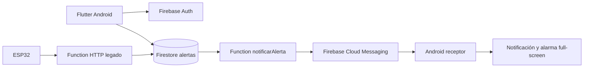
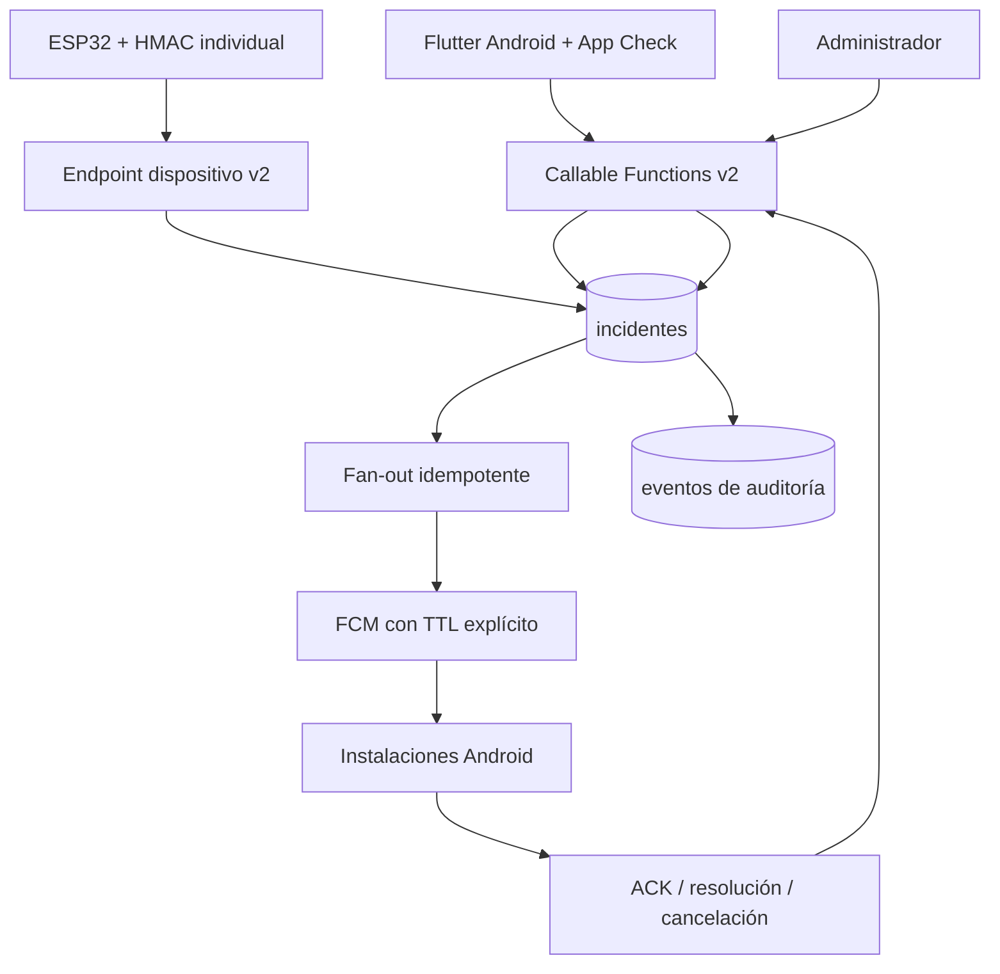

# Arquitectura de CENTINELA

## Arquitectura inicial

Limitaciones estructurales iniciales:

- autorización basada principalmente en interfaz;
- Rules remotas permisivas;
- campos `sede` de texto sin aislamiento;
- creación privilegiada desde clientes;
- incidentes sin ciclo de vida;
- token único;
- clave global ESP32;
- Functions y Firestore en regiones distintas.

## Arquitectura objetivo de la evolución v2

Principios:

1. Los privilegios provienen de Custom Claims y se validan en backend/Rules.
2. `sedeId` es un identificador normalizado y obligatorio para autorización.
3. El cliente solicita operaciones; el backend completa campos protegidos.
4. Los incidentes tienen versión de esquema, expiración y máquina de estados.
5. Cada instalación mantiene su token sin sobrescribir otros dispositivos.
6. La recepción valida sesión, sede, rol, estado y vigencia.
7. Duplicación y reintentos se tratan de manera idempotente.
8. El hardware no decide su sede/sala y usa credencial individual fuera de Git.
9. Android es la única plataforma declarada funcional.

Los límites de la distribución pública y los pasos de configuración se describen en el [README](../README.md). Las pruebas físicas deben repetirse en cada instalación.

