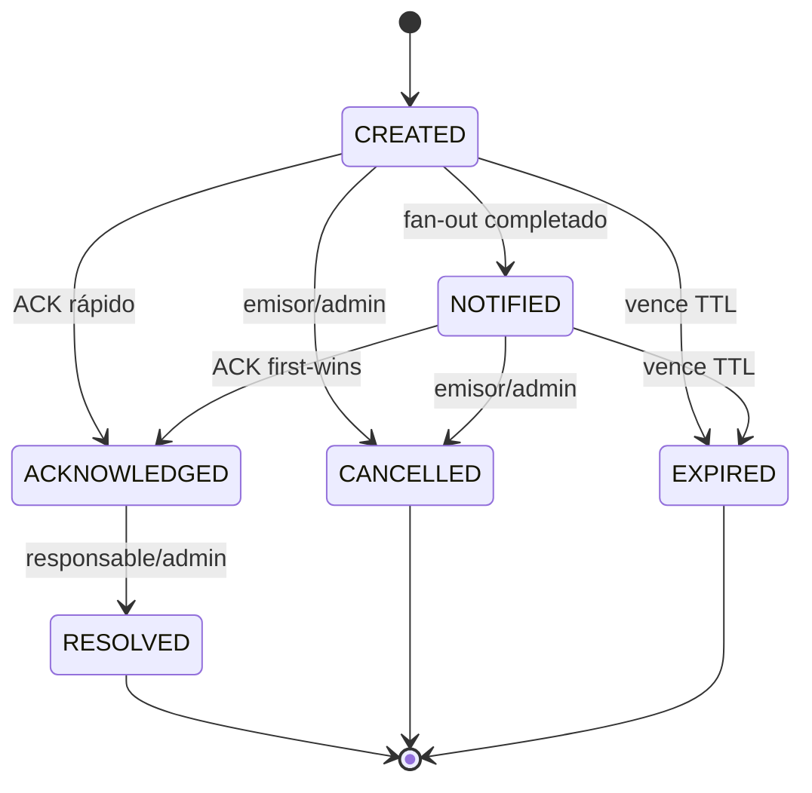

# Modelo de datos CENTINELA v2

Este documento describe el contrato implementado en el código local. Los campos
protegidos los escribe exclusivamente Admin SDK; las aplicaciones cliente solo
leen datos autorizados e invocan Functions.

## Claims de Firebase Auth

| Claim | Tipo | Uso |
|---|---:|---|
| `role` | string | `docente`, `inspector`, `direccion` o `admin` |
| `sedeId` | string | frontera obligatoria de aislamiento |
| `active` | boolean | habilitación efectiva de la cuenta |
| `mustChangePassword` | boolean | bloquea operaciones hasta cambiar la clave temporal |

El perfil Firestore refleja estos valores para la interfaz, pero no otorga
privilegios. Los claims solo se asignan con Admin SDK.

## `usuarios/{uid}`

Campos principales: `schemaVersion`, `email`, `nombre`, `role`, `sedeId`,
`active`, `mustChangePassword`, `createdAt`, `createdBy`, `updatedAt` y
`passwordChangedAt`. Un usuario puede leer su perfil; un administrador solo
puede consultar perfiles de su propia sede. No hay escrituras cliente.

### `usuarios/{uid}/instalaciones/{installationId}`

Cada instalación Android conserva su propio registro: `uid`, `sedeId`, `role`,
`platform`, `fcmToken`, `appVersion`, `deviceModel`, `active`,
`appCheckPresent`, `createdAt`, `updatedAt` y `lastSeenAt`.

- el identificador aleatorio estable se mantiene en preferencias locales;
- el token se registra por callable y nunca en el perfil raíz;
- un mismo token encontrado en otra instalación se invalida allí;
- logout desactiva la instalación y elimina el token FCM local;
- respuestas FCM de token inválido desactivan el documento correspondiente.

## `sedes/{sedeId}` y `sedes/{sedeId}/salas/{salaId}`

Las sedes y salas usan identificadores estables. Las salas contienen al menos
`nombre` y `active`. La aplicación no inventa nombres ni usa texto libre para
autorizar. `salaId` puede ser nulo y se muestra una degradación explícita.

## `incidentes/{incidentId}`

| Grupo | Campos |
|---|---|
| Identidad | `schemaVersion: 2`, `nivel`, `etiqueta`, `sedeId`, `salaId` |
| Snapshot | `salaNombreSnapshot`, `nombreEmisorSnapshot` |
| Origen | `origen`, `emisorUid`, `dispositivoId`, `simulacro` |
| Ciclo de vida | `estado`, `createdAt`, `expiresAt`, `updatedAt` |
| ACK | `acknowledgedAt`, `acknowledgedBy`, `acknowledgedByName` |
| Cierre | `resolvedAt`, `resolvedBy`, `cancelledAt`, `cancelledBy`, `cancellationReason` |
| Fan-out | `fanoutStatus`, `fanoutAttempts`, `deliveredCount`, `failedCount`, `notifiedAt` |
| Control | `requestFingerprint`, `retentionDeleteAt` |

El ID se deriva de `SHA-256(scope:idempotencyKey)` y evita crear dos incidentes
ante un reintento legítimo. Si una misma clave llega con otros datos, se rechaza.

La transacción de ACK es `first-wins`: el primer receptor autorizado queda como
responsable. Repetir el mismo ACK devuelve el resultado existente sin reescribir
la autoría. Solo ese responsable o un administrador puede resolver.

### `incidentes/{incidentId}/eventos/{eventId}`

Auditoría inmutable creada por backend: `CREATED`, `NOTIFIED`, `ACKNOWLEDGED`,
`RESOLVED`, `CANCELLED` y `EXPIRED`, con hora, origen y actor cuando corresponde.

## Datos internos

- `limites/{scope}`: ventanas de frecuencia por usuario o dispositivo.
- `despachosNotificacion/{incidentId}`: lease, intentos y resultado del fan-out.
- `dispositivos/{deviceId}`: asociación servidor de sede/sala, `active`, nombre,
  `secretId` y modo simulacro; nunca contiene el secreto.
- `dispositivos/{deviceId}/nonces/{hash}`: defensa anti-replay con expiración.
- `alertas`: colección legada cerrada para clientes y solo considerada por la
  migración explícita.

## Matriz de lectura/acción

| Rol | Emite | Nivel 1 | Nivel 2/3 | ACK | Resuelve | Administra |
|---|---:|---:|---:|---:|---:|---:|
| docente | sí | solo propios | solo propios | no | no | no |
| inspector | sí | sí | sí | sí | si fue responsable | no |
| dirección | sí | no | sí | sí | si fue responsable | no |
| admin | sí | sí | sí | sí | sí | solo su sede |

Todas las celdas están además condicionadas por `active == true`, cambio de
contraseña completado y coincidencia exacta de `sedeId`.
